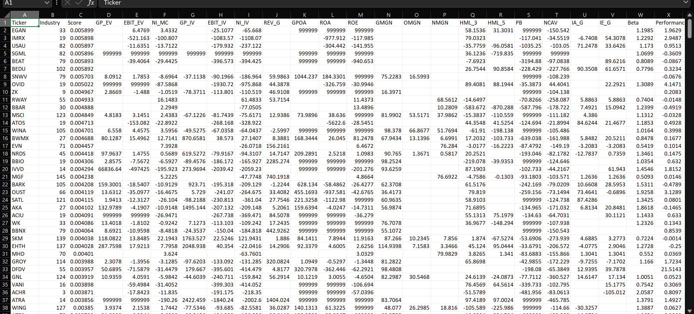

Proof of concept, so data, model and backtest architecture is simple.
- Backtest results are a step function(so vol laundering), limited lookback period, limited combination tested, etc.   
- Limited linear combinations of factors tested to allow for shorter run time and prevent overfitting.  
- Tested year by year, so allows out of sample and live testing.  
- Allows for (market) beta neutral, dollar neutral, long-only, short-only, etc
 
# Backtest 
performance

data

# Backtest Old
Long+Short

Long Only

Long Only2

# Data
FY2025 Rank

